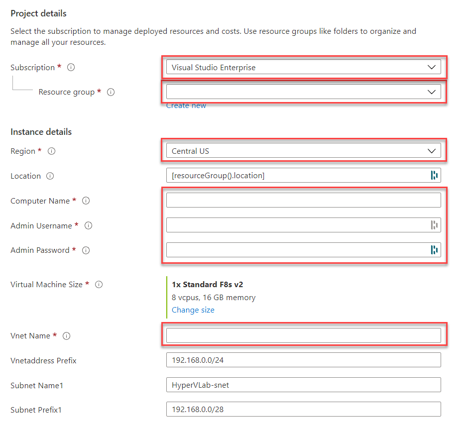
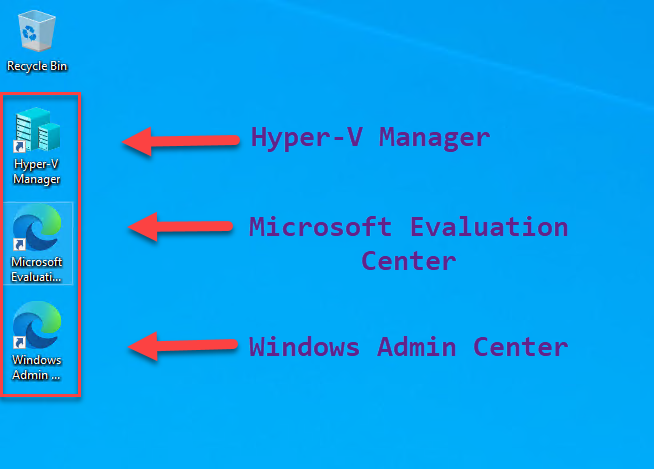

# Azure Hyper-V Lab

Hey everyone 👋

This Template will automate the deployment of an Azure IaaS VM running Windows Server 2022 OS, having Hyper-V Role enabled. By this, you will be able to experiment freely with Hyper-V, learn, build Proof-Of-Concept or non-production environments or even use it as staging environment for creating custom images that will be used on public Azure.

The Template consists of the following resources:

+ A Virtual Network(VNet) with 1 Subnet
+ A Standard SKU Static Public IP
+ A Network Security Group (NSG)
+ A Virtual Machine that is capable of Nested Virtualization - <a href="https://www.markou.me/2020/05/which-azure-vm-sizes-support-nested-virtualization/" target="_blank">Markou.me</a>
+ Two Premium SSD Disks - One for Operating System(128GB) and One for Storing Virtual Machines(512GB)

Server Roles:

+ Hyper-V
+ DHCP Server
+ RSAT Tools

Additional Software Included with the VM:

+ Azure Az PowerShell module
+ Azure CLI
+ Azure Storage Explorer
+ AzCopy Utility
+ PowerShell Core
+ Windows Admin Center
+ 7-Zip
+ Chocolatey Package Manager

Press the button below to deploy the Template using the Azure Portal:

## Get Started

1. Press Deploy to Azure Button to initiate the deployment.

2. Fill in the required information. The resultant

3. Enjoy a cup of coffee :coffee: while waiting for the deployment to finish(Approx 15m).

4. Connect to the newly deployed VM using Remote Desktop.

5. Start Managing Hyper-V either using Hyper-V Manager or Windows Admin Center.

## General Notes

+ There is a large list of VM sizes specified as allowed values within the Template. Just to make your life easier and avoid deployment errors :superhero:.
+ To evaluate Microsoft Software and Operating Systems, use the Desktop Shortcut of the Microsoft Evaluation Center.
+ The default path for storing Virtual Machine configuration files is "F:\VMS" and for disks is "F:\VMS\Disks".
+ Enhanced Session Mode is set to Enabled.
+ A DHCP Scope is present, providing Network Addressing to Virtual Machines.
+ An Internal Hyper-V Switch that is Nat enabled is present.
+ The Data Disk (Volume F) is formatted with ReFS and unit size 64KB.
+ You will find both JSON and Bicep Templates within this repo.
+ The DSC Configuration File is listed here [here](dsc/DSCInstallWindowsFeatures.ps1).
+ The Host Configuration File is listed here [here](/HostConfig.ps1).

## Learn more about Hyper-V

+ Windows Server Hyper-V and Virtualization Learning Path on [Microsoft Learn](https://docs.microsoft.com/en-us/learn/paths/windows-server-hyper-v-virtualization/)
+ Markou.me Hyper-V [Blog](https://www.markou.me/category/hyper-v/)
+ Virtualization [Blog](https://techcommunity.microsoft.com/t5/virtualization/bg-p/Virtualization)